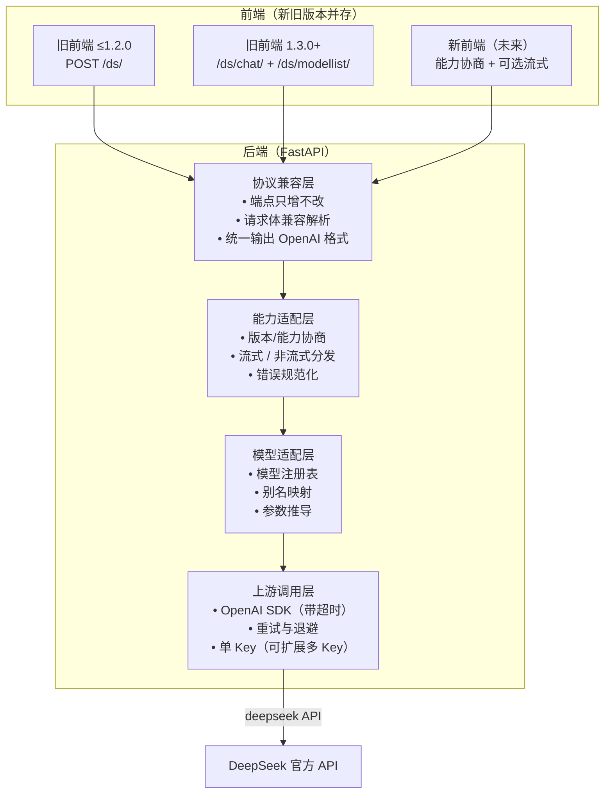

# Deepseek Chat Website 后端兼容性设计

> 目标：**后端格式可以随时更新，但所有已发布的前端版本都仍能正常工作**，同时为即将上线的流式输出铺路。
> 本文只做方案设计，不包含实现代码。

---

## 1. 背景与目标

### 1.1 现状

- 前端为本地网页文件（`index.html`），由用户自行保存；后端不定期更新格式，前端版本却未必跟着更新。
- 当前契约：`POST /ds/chat/`（请求体含 `model`、`messages`）+ `GET /ds/modellist/`（返回 `[{name, display_name}]`），响应为 OpenAI 兼容格式（`choices[0].message.content`、可选 `reasoning_content`）。
- 模型名在 `getai.py` 中硬编码两处（`model_list` 与 `model_name_to_param`），官方模型名/参数一变就要手改，且容易两边不一致。
- DeepSeek 官方已经弃用旧名 `deepseek-chat` / `deepseek-reasoner`，现在实际调用的是 `deepseek-v4-flash` / `deepseek-v4-pro` + `thinking` + `reasoning_effort`。

### 1.2 核心痛点

| 痛点 | 表现 | 后果 |
| --- | --- | --- |
| 模型名频繁变化 | `deepseek-chat` → `deepseek-v4-*` | 旧前端传入的模型名失效 |
| 后端格式不定期更新 | 响应结构或端点变化 | 旧前端解析失败、白屏 |
| 即将上线流式 | 响应从 JSON 变为 SSE | 旧前端无法解析流式，直接报错 |
| 错误处理零散 | `{"error": str(e)}`、KeyError 直接 500 | 前端无法区分"可重试"与"必失败" |

### 1.3 设计目标（约束条件）

1. **向后兼容是硬约束**：后端任意升级后，所有历史前端版本（1.0.0 ~ 1.6.0）都能正常聊天。
2. **流式上线不得破坏现有前端**：默认非流式，流式只能通过"显式请求"或"能力协商"触发。
3. **错误可识别、可重试、不泄露内部信息**。
4. **模型名变化只需改一处**：以"模型注册表"为中心，接口与前端无感。
5. 允许前后端配合：可引入版本/能力协商机制（前端小改，旧前端无需改）。

---

## 2. 兼容性现状盘点（基于 GitHub Releases 与各版本源码）

### 2.1 已发布版本时间线

| 时间 | 后端 | 前端 | 关键变化 |
| --- | --- | --- | --- |
| 2026-04-28 | backend v1.0.0 | frontend v1.0.0 | 首个可用版本；路径式接口 `/{client}/{model}/{message}/`（client 为 `normal` / `super`） |
| 2026-04-28 | backend v1.1.0 | frontend v1.1.0 / v1.1.1 | 请求路径改为 `/ds/{model}/{message}/`；移除 `v3.2_speciale_expires_on_20251215` |
| 2026-04-28 | backend v1.2.0 | frontend v1.2.0 | 改用请求体：`POST /ds/`，支持多轮对话 |
| 2026-05-02 | backend 1.3.0 | frontend 1.3.0 | 适配 DeepSeek V4；新增 `/ds/modellist/`；对话接口改名 `/ds/chat/`；**旧接口 `/ds/` 同时被改为 GET**（v1.2.0 时期它是 POST）；release 声明兼容网页版 1.2.0+ |
| 2026-05-02 | backend v1.3.1 | — | 修复 `/ds/modellist` 缺少末尾斜杠导致的重定向 |
| 2026-05-02 ~ 07-12 | — | frontend v1.4.0 ~ v1.5.1 | Markdown 渲染与手动开关、对话记录保存、标题栏固定等（接口不变） |
| 未发布 | main（当前工作区） | v1.6.0 | 对话框架重构、新对话下拉菜单（接口仍为 `/ds/chat/` + `/ds/modellist/`） |

> **重要澄清**：v1.2.0 时代后端 `/ds/` 是 `POST`，与当时前端完全匹配（用户记忆中"一切正常"属实）。断点出现在 **backend 1.3.0**：改名 `/ds/chat/` 时把 `/ds/` 改成了 `GET`，于是 v1.2.0 前端（仍发 POST）从此无法使用——但 1.3.0 / 1.3.1 的 release 描述却写"客户端要求网页版 v1.2.0"，属于**声明与实现不一致**。此外当前 main 代码里 `/ds/` 的注释写的是"兼容网页版 1.3.0+"，与 release 说法也不一致。
>
> 目前 GitHub 上标记 Latest 的是 **backend v1.3.1** 与 **frontend v1.5.1**；工作区 main 分支的版本尚未发布 release。

### 2.2 各版本的实际契约（按"代"划分）

| 代 | 前端版本 | 调用方式 | 请求内容 | 响应要求 |
| --- | --- | --- | --- | --- |
| Gen 0 | v1.0.0 | GET `/{client}/{model}/{message}/` | URL 路径传参，单轮 | `choices[0].message.content`、可选 `reasoning_content` |
| Gen 1 | v1.1.0 ~ v1.1.1 | GET `/ds/{model}/{message}/` | URL 路径传参，单轮 | 同上 |
| Gen 2 | v1.2.0 | POST `/ds/` | body `{model: deepseek-chat / deepseek-reasoner, messages}` | `choices[0].message.content`、可选 `reasoning_content`；`error` 为真则报错 |
| Gen 2.5 | v1.3.0 ~ v1.6.0 | `GET /ds/modellist/` + `POST /ds/chat/` | body `{model: 列表中的 name, messages}` | 同上；v1.6.0 还会校验 `content` 非空 |
| 未来 | 待设计 | 待设计 | 同上 + 流式标记 | SSE 流 |

**要点：** 前端接口实际经历了三代（路径式 → 路径式 → 请求体式），Gen 2 之后才出现"动态模型列表"，而 Gen 2/Gen 2.5 的响应格式始终是 OpenAI 兼容格式——这是所有版本共有的"最大公约数"。

### 2.3 现有后端的兼容缺口

| 缺口 | 说明 | 影响 |
| --- | --- | --- |
| `/ds/` 被改成了 GET（backend 1.3.0 起） | v1.2.0 时代它是 **POST**，与当时前端匹配、一切正常；1.3.0 改名时被改成 GET，且 GET 还带请求体 | v1.2.0 前端（仍发 POST `/ds/`）得到 405；**release 声明"客户端要求网页版 v1.2.0"与实现不符** |
| GET 带请求体 | 非标准做法，大部分浏览器 fetch 不会发送 GET body | 即使允许 GET 也收不到消息 |
| Gen 0 / Gen 1 无路由 | `/normal/deepseek-chat/{msg}/`、`/ds/deepseek-chat/{msg}/` 都被删除 | v1.0.0 / v1.1.x 前端无法使用（目前已无官方声明支持） |
| 未知模型直接 KeyError | `model_name_to_param[use_model]` 在模型不存在时抛异常 | 返回 500，而非可读错误 |
| 模型名硬编码两处 | `model_list` 与映射表分离 | 容易漏改、不一致 |
| 无超时 / 无重试 | 上游卡住时请求会一直挂着 | 前端一直显示"正在生成" |
| 错误格式不统一 | 本地错误是 `{"error": str}`，上游错误是 OpenAI 错误对象 | 前端拿不到稳定信息 |

### 2.4 上游（DeepSeek API）的不确定因素

- 模型名会继续改名/废弃（已有先例）。
- 参数可能变化：`thinking.type`、`reasoning_effort` 是新增的，未来可能扩展。
- `reasoning_content` 是 DeepSeek 特有字段（OpenAI 标准没有），上游若调整，兼容层需要兜底。

---

## 3. 总体设计：四层兼容模型

**核心思想：越靠近前端契约越"冻结"，越靠近上游越"可变化"。**

- 协议兼容层：对前端承诺的契约，**只增不改、永不删除**。
- 模型适配层：把所有会变化的东西（模型名、参数）收敛到一个注册表。
- 上游调用层：唯一允许"变化"和"失败"的地方，由它承担重试、超时。

---

## 4. 协议兼容层

### 4.1 端点策略：只增不改

| 端点 | 方法 | 服务对象 | 处理 |
| --- | --- | --- | --- |
| `/ds/` | 恢复 POST（必要时同时允许 GET） | 前端 ≤1.2.0 | **v1.2.0 时期为 POST 且工作正常；1.3.0 起被改成 GET 属回归缺陷**。恢复 POST 后旧模型名走别名映射 |
| `/ds/chat/` | POST | 前端 1.3.0+ | 保持现状：默认非流式 |
| `/ds/modellist/` | GET | 前端 1.3.0+ | 保持返回**纯数组** `[{name, display_name}]`，不可包装成对象（旧前端直接遍历数组） |
| `/ds/version/` | GET | 新前端（可选） | 新增：返回后端版本与能力清单 |
| 流式端点 | POST | 新前端 | 见第 6 节（两种可选形态，待拍板） |

**规则：**

1. 已有端点的语义、字段、返回结构永不改变；升级只允许"新增可选能力"。
2. `model_list` 中每个 `name` 必须保证后端能解析（由注册表统一生成，见第 5 节）。
3. 旧前端的所有解析路径（`responseData.error`、`choices[0].message.content`、`reasoning_content`）必须始终存在。

### 4.2 响应契约：永远输出 OpenAI 兼容格式

- 所有聊天响应（无论新旧端点、无论流式与否）都保持 OpenAI 兼容结构，这是各版本前端共同的"最大公约数"。
- `reasoning_content` 属于本项目的软契约：有思考时返回（旧前端据此渲染思考过程）；上游若不再返回，由适配层补齐/标注，保证旧前端行为不变。
- 新增信息只放在既有字段**旁边**（平级附加字段），绝不改变既有字段含义。

---

## 5. 模型适配层：模型注册表

### 5.1 结构与职责

以"前端模型标识（对外名）"为键的注册表，每项包含：

| 字段 | 含义 | 示例 |
| --- | --- | --- |
| `model_id` | 前端看到的稳定标识（可长期不变） | `deepseek-v4-flash-high` |
| `display_name` | 前端展示名 | `DeepSeek V4 Flash 深度思考-high` |
| `api_model` | 真正传给上游的模型名 | `deepseek-v4-flash` |
| `thinking` | 思考模式（disabled / enabled） | `enabled` |
| `reasoning_effort` | 思考强度（可选） | `high` |
| `aliases` | 历史旧名（用于旧前端） | `deepseek-reasoner` |
| `deprecated` | 是否已废弃（只是登记，不删除） | `false` |

### 5.2 关键设计点

1. **注册表是唯一数据源**：`model_list` 由注册表投影生成，前端看到的每个 `name` 必然可被后端解析，杜绝"列表有、调用无"。
2. **别名映射**：`deepseek-chat` → `deepseek-v4-flash-chat`（即 flash + 思考关闭）；`deepseek-reasoner` → `deepseek-v4-flash-high`。旧前端无需任何修改。
3. **官方再改名**：只更新注册表（或增加一条别名），接口代码零改动。
4. **未知模型**：返回统一错误 `MODEL_NOT_FOUND`（可重试标志为否），而不是 KeyError / 500。
5. **可选扩展**：`model_list` 每项可附带能力字段（如 `supports_stream`），供新前端在渲染选项时直接判断；旧前端忽略多余字段，不受影响。

---

## 6. 流式兼容设计（试验性功能）

### 6.1 定位与原则

> **非流式 = 正式支持路径（默认、唯一被依赖的路径）**；**流式 = 测试功能**，默认关闭，仅在显式启用时生效，且不参与任何兼容性承诺。

- 旧前端永远走非流式，行为与今天完全一致。
- 流式只能通过"显式请求标记 + 后端开关（环境变量/配置）"双重条件触发，满足"测试功能"定位：宁可打不开，不可默认开。
- 流式尚未定型（SSE / WebSocket 未定），因此**逻辑上先定义"事件流"，与传输方式解耦**，后续切换传输层不影响业务逻辑。

### 6.2 触发形态（待拍板，二选一）

| 方案 | 说明 | 优点 | 缺点 |
| --- | --- | --- | --- |
| A. 独立新端点 | 新增 `POST /ds/chat/stream/` | 新旧彻底隔离，旧端点代码零改动；行为最保守 | 端点变多 |
| B. 同端点加字段 | `/ds/chat/` 请求体可选 `stream: true` | 同一入口；新前端代码简单 | 需确保旧前端不带该字段（默认 false 即可） |

推荐 **B**：默认 `stream=false`，天然向后兼容，且未来前端从 `/ds/version/` 拿到能力后自行决定。

### 6.3 传输方式：SSE vs WebSocket（未定，设计上先解耦）

| 维度 | SSE | WebSocket |
| --- | --- | --- |
| 与 OpenAI 兼容性 | 与 OpenAI 官方流式格式一致，迁移成本低 | 需自定义帧格式 |
| 前端实现 | `fetch` 流式读取 / `EventSource`，天然支持 | 需 `WebSocket` API，状态管理更复杂 |
| 调试 | 可用 curl 直接测 | 需要专门客户端 |
| 结束与错误 | 标准 `[DONE]` / 事件 | 自定义消息类型 |
| 双向通信 | 仅服务端→客户端（本项目够用） | 支持双向（可做"停止生成"等） |
| 反向代理/防火墙 | 友好 | 需配置 upgrade 支持 |

> **倾向建议：先做 SSE**——OpenAI 官方流式就是 SSE，`client.chat.completions.create(stream=True)` 直接可用，前端用流式 reader 也简单，还可用 curl 调试。若后续需要"客户端主动中止/推送消息"再升级 WebSocket。**但最终以你的决定为准**，设计上把"事件流"与"传输编码"分开，两者可替换。

### 6.4 事件流设计（与传输方式无关的逻辑层）

- 事件类型（建议）：`content`（增量正文）、`reasoning`（增量思考，DeepSeek 的 `delta.reasoning_content`）、`done`（结束）、`error`（失败，携带统一错误体）。
- 兼容性验证点：**非流式与流式最终拼接出的正文必须一致**（可做一致性测试）。
- 流式重试：只在首个 token 到达前允许重试；一旦开始输出正文，中断后直接发 `error` 事件结束，不做自动续传。
- 旧前端防误用：旧前端根本不发流式标记，后端按非流式兜底，天然免疫。
- 测试开关：`stream` 能力在 `/ds/version/` 的 `features` 中标记为 `experimental`（见 8.1），未开启时即使请求带 `stream: true` 也按非流式处理并返回提示（或忽略）。

---

## 7. 错误处理与重试

### 7.1 统一错误模型（兼容优先）

旧前端只认 `error` 字段是否为真，因此 **`error` 必须继续是顶层字符串**；新信息作为平级附加字段（前端可忽略）：

| 字段 | 类型 | 说明 |
| --- | --- | --- |
| `error` | string | 人类可读错误（保持现状，旧前端可显示） |
| `code` | string | 稳定错误码（新前端据此分支处理） |
| `retryable` | bool | 是否建议重试 |
| `retry_after` | number | 建议等待秒数（限流时） |

### 7.2 错误码表（建议）

| 错误码 | HTTP 状态 | 场景 | 可重试 |
| --- | --- | --- | --- |
| `INVALID_REQUEST` | 400 | 缺少 model / messages 等 | 否 |
| `MODEL_NOT_FOUND` | 400 | 未知模型名 | 否 |
| `AUTH_FAILED` | 401 | API Key 无效 | 否 |
| `RATE_LIMITED` | 429 | 上游限流 | 是（尊重 retry_after） |
| `UPSTREAM_ERROR` | 502 | 上游 5xx / 服务不可用 | 是 |
| `TIMEOUT` | 504 | 连接/读取超时 | 是 |
| `INTERNAL` | 500 | 未预期异常 | 否（需人工排查） |

### 7.3 重试策略

1. **触发条件**：429、上游 5xx、网络错误、超时；**不重试** 400/401（重试必失败）。
2. **算法**：指数退避 + 随机抖动，例如基础 1s 起，翻倍，上限 8s；默认最多 3 次（可配置）。
3. **幂等前提**：非流式请求在"尚未开始产生结果"阶段才重试——即每次重试都是完整的新请求，不存在半截结果问题。
4. **流式重试**：只在首个 token 到达前允许重试；一旦开始输出正文，中断后直接发 error 事件结束，不做自动续传。
5. **防放大**：对单用户/单 Key 做简单令牌桶限流（可选），避免重试把 Key 打爆。
6. **日志**：记录 client 版本、模型、错误码、重试次数、总耗时（脱敏，不记录对话内容）。

### 7.4 超时

- 连接超时与读取超时分开配置（如连接 10s、读取 120s，针对思考模式可放宽）。
- 超时统一映射为 `TIMEOUT`，返回可重试标记。

---

## 8. 版本协商机制

### 8.1 接口

- `GET /ds/version/` 返回：
  - `backend_version`：后端自身版本号
  - `api_version`：API 版本（如 `1`）
  - `features`：能力清单（如 `error_codes: true`、`retry: true`、`stream_experimental: true`）——流式属于测试功能，用独立能力位标记，未开启时前端不得使用
  - `model_list_version`：模型注册表版本（前端可用于缓存判断）
- 可选请求头 `X-DS-Client-Version`：前端版本号（如 `1.6.0`）。缺失表示未知/旧前端。

### 8.2 协商规则

1. 新前端启动时先请求 `/ds/version/`，按 `features` 决定是否启用流式、是否展示错误码详情。
2. **未声明/未拿到能力 = 按最低兼容行为（v1 非流式）**，这是天然降级路径。
3. 请求头可选携带 `X-DS-Client-Version`（新前端）；旧前端不发，后端按最低兼容处理。
4. 后端升级只允许**增加** features，不允许改变已有语义（配合契约测试）。
5. **后端可检查前端版本号（`X-DS-Client-Version`），但用途有限定**：
   - 记录与统计：日志中标注"该请求来自 frontend vX.Y.Z"（排障、版本分布）；
   - 提示：对已知过旧版本，返回"建议升级"类提示（非错误）；
   - 兜底：对已知问题版本启用最保守的行为路径。
   - **版本号只是"输入信息"，不是"决策依据"**——决策依据始终是能力清单（features）；版本号缺失时一律按最低兼容处理，**绝不因版本号拒绝请求**。

### 8.3 为什么用"能力协商"而不是"版本号判断"

- 前端版本号与后端 API 版本是两回事，用版本号比较容易写出一堆 if-else 分支。
- 能力清单是"该功能是否可用"，语义清晰；未知能力一律忽略，天然向前兼容。
- 前端版本号只回答"**谁**在调用"（配合日志/提示），能力清单回答"**能做什么**"（配合决策）——两者配合使用，但职责不混。

### 8.4 版本号管理策略：如何避免"大版本号变成几十"

**核心：把三种版本彻底分开，并按严格 SemVer 诚实标注破坏性变更。版本号小是因为"少做破坏性变更 + 集中发布"，而不是把破坏性伪装成小版本。**

| 版本 | 代表什么 | 何时变化 | 例子 |
| --- | --- | --- | --- |
| 前端版本 `frontend/v1.x` | 用户手里的软件 | 功能/界面更新 | v1.2.0 → v1.6.0 |
| 后端版本 `backend/v1.x` | 后端自身的迭代 | 任何后端改动（含 bug 修复） | v1.3.1 → v1.3.2 |
| API 版本 `api_version` | **HTTP 接口契约（已发布端点的集合）** | 破坏性变更按路线 B 处理（积攒合并） | 1.0 → 2.0 |

**破坏性变更的判定（严格 SemVer）**：任何导致现有使用者需要修改才能正常工作的改动都是破坏性变更，包括：删除或重命名已发布端点、修改已发布字段语义、改变既有行为、移除已废弃功能（即使已先标废弃）、以及"修复了用户已依赖的 bug"。

**已选路线 B（用户拍板）：API 版本冻结在 1.0，破坏性变更"积攒合并"发布。**

- 冻结后：只增不改——新增端点/字段/能力 = minor，修复 bug（未被依赖）= patch。
- 所有想删的（`/ds/`、路径式旧接口等）先标记废弃并**积攒**，择机一次性发布 `2.0.0` 合并删除。
- 一次一个 major，**不是每个接口升一次**，因此不会出现 v50。

**判定标准（正式规则）：**

| 变更类型 | 例子 | 是否破坏 | 版本动作（路线 B） |
| --- | --- | --- | --- |
| 删除已发布端点（即使已废弃） | 删 `/ds/`、删 `/ds/chat/` | 是 | 先标记废弃、积攒，随下次 MAJOR（2.0.0）删除 |
| 修改已发布字段语义 | 改 `content` 的含义 | 是 | 同上（积攒到 MAJOR） |
| 修复用户已依赖的行为 | 某 bug 被用户反向依赖 | 是（特殊考量） | 评估 + 公告后随 MAJOR 处理 |
| 新增端点 / 字段 / 参数 | 加 `/ds/version/` | 否 | MINOR |
| 修复 bug（未被依赖） | `/ds/` 误用 GET，恢复 POST | 否（属 bug 修复） | PATCH |

**对当前项目的结论：**

1. `/ds/` 误用 GET → **恢复 POST 是标准 PATCH**：修复的是"违反已发布承诺"的 bug，且该行为未被用户反向依赖，不涉及任何版本号变化。
2. 未来删除已发布端点（如 `/ds/`）= **破坏性变更**：按路线 B 攒入 2.0.0 合并发布——**不需要"每删一个就升一次"，因此不会出现 v50**。
3. release 中"客户端要求：网页版 vX.X 以上"的公告是**向用户披露**破坏性变更，不改变版本规则本身。

---

## 9. 兼容矩阵（验收清单）

**按支持级别划分：**

| 级别 | 前端版本 | `POST /ds/` | `POST /ds/chat/` | `GET /ds/modellist/` | 流式 | `/ds/version/` |
| --- | --- | --- | --- | --- | --- | --- |
| 活跃支持 | v1.3.0 ~ v1.6.0 | — | ✅ | ✅（纯数组） | —（不感知） | —（不感知） |
| 兼容保留 | v1.2.0 | ✅（需补齐 POST） | — | — | —（不感知） | — |
| 历史存档（不建议） | v1.0.0 / v1.1.x | —（路径式接口已废弃） | — | — | — | — |
| 未来 | 新前端（流式，测试） | — | ✅（默认非流式，正式路径） | ✅ | ⚠️ 测试功能：需后端开关 + 显式请求 | ✅（可选） |

> 说明：v1.0.0 / v1.1.x 使用两代前的路径式接口（`/normal/...`、`/ds/{model}/{msg}/`），复活它们需重建旧路由，成本高且用户几乎不可能还在用，建议在 `/ds/version/` 中记为"已废弃的历史接口"。
>
> 每期升级后，用**各历史版本前端的请求样本**做一次回放测试（契约测试），保证以上矩阵不回归。样本建议直接取自各 release 的 zip 包（`frontend-v1.2.0.zip`、`frontend-v1.3.0.zip` 等）。

---

## 10. 实施路线（分期，均为兼容优先）

| 阶段 | 内容 | 影响面 |
| --- | --- | --- |
| P1 | 错误规范化（统一错误码 + retryable）；模型注册表重构（消除硬编码）；未知模型返回 `MODEL_NOT_FOUND`；修复 `/ds/` 只支持 GET 的缺陷（或明确废弃）；**增加契约测试：把每个端点的 HTTP 方法 + 请求/响应样本固化成测试**，防止今后再出现"写错 GET/POST"这类事故 | 纯后端，行为可观察 |
| P2 | 新增 `/ds/version/` 能力协商；新前端接入（可选） | 前后端小改 |
| P3 | **试验性流式**：先定传输方式（SSE 优先），以环境变量/配置开关控制，**默认关闭**；测试通过后再决定是否转正 | 前后端中改，不影响非流式 |
| P4 | 重试/退避、限流、超时、监控日志 | 纯后端 |

每期发布前必做：**旧前端样本回归**（至少覆盖 v1.2.0、v1.3.0、当前 1.6.0 三条调用路径）。

---

## 11. 决策记录

### 11.1 已确认

1. **兼容底线：保留 v1.2.0（用户已拍板）。** v1.2.0 在已发布的承诺范围内（backend 1.3.0 / 1.3.1 的 release 声明"客户端要求：网页版 v1.2.0"），当前 `/ds/` 被写成 GET 是**违反自身承诺的 bug**；修复（恢复 POST + `deepseek-chat` / `deepseek-reasoner` 别名映射 + 契约测试）属 bug 修复，零版本号变化。
   - 未来若真要放弃 v1.2.0：属于**官方破坏性变更**，走正式流程——新 release 公告"客户端要求改为 v1.3.0+" → 过渡期 → `api_version` 升 2 时移除，不能悄悄改口。
   - v1.0.0 / v1.1.x（路径式接口）：历代最新 release 的"客户端要求"从未包含它们（1.1.0 起就要求 v1.1.0+，1.2.0 起要求 v1.2.0+），且接口已被两代替换，建议明确放弃、不再纳入（在 `/ds/version/` 记为历史）。
2. **版本策略：采用路线 B（用户已拍板）。** API 版本冻结在 1.0，破坏性变更积攒合并到 2.0.0 一次性发布；API 版本号与前端/后端产品版本号分离。
3. **引入 `X-DS-Client-Version` 请求头（用户已拍板）。** 后端可检查前端版本号，用途限定为：日志统计、版本过旧提示、已知问题版本兜底；**版本号只作输入信息，不作决策依据**，缺失时按最低兼容处理，绝不拒绝请求。
### 11.2 待拍板

1. **流式定位与形态**：
   - 已定：非流式保留为正式路径；流式仅测试功能、默认关闭。
   - **传输方式**：SSE 还是 WebSocket？（未定；建议先 SSE，设计已按"事件流与传输解耦"预留切换空间）
   - **触发方式**：独立端点（A）还是 `/ds/chat/` 加 `stream` 字段（B）？
2. **错误响应格式**：保持"顶层 `error` 字符串 + 附加字段"（推荐，旧前端零改动）还是结构化嵌套（不推荐，旧前端无法显示）？
3. **重试默认配置**：默认开启、最多几次、上限间隔？
4. **多 API Key / 自备 Key**：当前单环境变量 Key，是否纳入本期（默认不纳入，仅作为注册表未来扩展点）。
